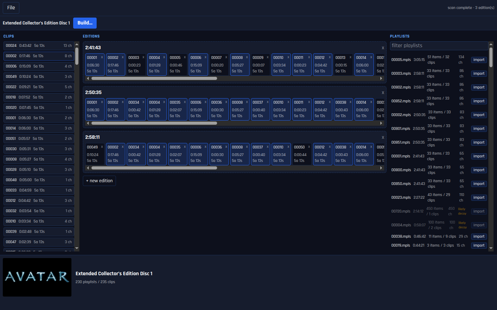

# mkv-editions

Rebuild a Blu-ray's alternate cuts (Theatrical / Extended / Special Edition, and
multi-angle discs) into editioned MKVs from the shared on-disc segments - either
as one self-contained file per cut, or with the shared video stored just once.
Use it two ways: a Python CLI, or a desktop workbench.



## Requirements

On your `PATH`:

- **python3**, **mkvmerge** + **mkvextract** (MKVToolNix), **ffprobe** (FFmpeg), **bash** - the scan/build engine. `mkvextract` also backs the in-app chapter viewer; it ships with MKVToolNix alongside `mkvmerge`.
- **Node.js + npm** - only for the desktop app.
- **7z or unzip** - only if you open a disc as a ZIP in the app.

You also need a **decrypted BDMV**: rip the disc with MakeMKV in Backup mode to
get a `BDMV/` folder (containing `PLAYLIST/` and `STREAM/`).

> Running a packaged AppImage: the same tools (`python3`, `mkvmerge`, `ffprobe`)
> must be on PATH. An AppImage launched from a file manager can have a stripped
> PATH - if the tools are not in `/usr/bin`, launch it from a terminal or set
> `MKVED_PYTHON` to a full `python3` path.

## Quick start - CLI

```bash
# flat (default): one self-contained, plays-anywhere file per cut
./mkv-editions.sh --install-deps /path/to/BDMV ./out --title "Fellowship" \
    "Theatrical Cut=00001.mpls" "Extended Cut=00002.mpls"
cd out && bash build.sh
```

`--install-deps` checks/installs mkvmerge, ffprobe, and python3. Identify the
`.mpls` playlist names from MakeMKV's title info or bdinfo. Pass more
`"Name=NNNNN.mpls"` pairs for more editions.

## Quick start - desktop app

```bash
./run-app.sh          # build the app, then open the workbench window
./run-app.sh dev      # hot-reload dev mode (Ctrl-C stops it)
```

Open a ripped-disc folder (or a ZIP of one, or a mounted ISO), pick the cuts,
and Build. The first launch installs the app's dependencies automatically. The
app runs from source; there is no packaged installer yet.

## Modes

Choose with `--mode` on the CLI, or in the app's build settings:

| Mode | Output | Plays in | Disk space |
|---|---|---|---|
| `flat` (default) | one file per cut | everything (Plex / Jellyfin / Emby / mpv / VLC) | N x (shared video duplicated) |
| `linked` | a small master + shared `seg*.mkv` files | mpv only | 1 x + unique scenes |
| `xin1` | one file with the editions inside it | mpv only | 1 x + unique scenes |

Rule of thumb: **flat** for media servers, **linked** or **xin1** for a
space-efficient mpv library. Ordered chapters and segment linking work only in
mpv, because ffmpeg - which Plex, Jellyfin, Emby, and VLC all demux through -
does not implement them.

## Full documentation

The complete reference lives in
**[docs/editioned-mkv-reference.md](docs/editioned-mkv-reference.md)**: the
ordered-chapters + segment-linking technique end to end, every CLI option
(`--preserve-chapters`, `--qpfile`, multi-angle expansion, ...), the
`--scan-json` / `.mkvedproj` JSON contract for frontends, the synthetic-sample
validation (no disc needed), and the player-support background behind the mode
table above.

## Releases

Prebuilt Linux **AppImage** builds are attached to each entry on the
[Releases](https://github.com/uprightbass360/mkv-editions/releases) page.
Download it, `chmod +x mkv-editions-*.AppImage`, and run it. `python3`,
`mkvmerge`, and `ffprobe` must be installed (see Requirements).

## Conventional commits

Releases are automated from [Conventional Commits](https://www.conventionalcommits.org/).
Because PRs are squash-merged, the **PR title** is the commit that lands on `main`
and drives versioning, and a CI check requires it to be conventional:

- `feat: ...` - a new feature (minor bump)
- `fix: ...` - a bug fix (patch bump)
- `feat!: ...` or a `BREAKING CHANGE:` footer - a breaking change (major bump)
- `docs:` / `chore:` / `refactor:` / `ci:` / `test:` / `perf:` - no release on their own

## Cutting a release

Releases are automated by [release-please](https://github.com/googleapis/release-please):

1. Land PRs with conventional titles.
2. release-please opens (and keeps updating) a **"chore: release" PR** that bumps
   `app/package.json` + lockfile and updates `app/CHANGELOG.md`.
3. Merge that Release PR. That tags `vX.Y.Z`, publishes a GitHub Release with
   generated notes, and builds + attaches the Linux AppImage.

Manual fallback (still supported): bump `app/package.json` version (and
`cd app && npm install --package-lock-only`), commit, then
`git tag vX.Y.Z && git push origin vX.Y.Z` - the release workflow builds and
attaches the AppImage.

## Credits

Builds on [Xin1Generator][x1] (Sander), [aobikari][ao] (arch1t3cht), TheFluff's
["101 things you never knew you could do with Matroska"][tf], and the
[Matroska chapter spec][mk]. See the reference doc for what each contributed.

A big thank you to **[mihawk90](https://github.com/mihawk90)** for the testing,
feedback, and real-disc help that shaped this project.

[x1]: https://code.google.com/archive/p/xin1generator
[ao]: https://codeberg.org/arch1t3cht/aobikari
[tf]: https://mod16.org/hurfdurf/?p=8
[mk]: https://www.matroska.org/technical/chapters.html
